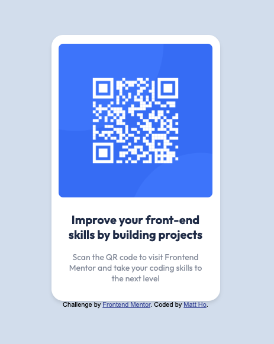

## Overview

### Screenshot

### Links

- Solution URL: 
- Live Site URL: [https://qr-code-alpha-nine.vercel.app/](https://qr-code-alpha-nine.vercel.app/)

## My process

### Built with

- HTML5
- CSS

### What I learned

So I am a software engineer already, but I needed practice on my foundational skills. Some cool things that I've learned/reinforce is simple things like importing a custom font (which doesn't come up alot in an already established code base).

Other cool things I've refreshed on are:
1. Writing CSS Classes manually instead of tailwind
2. Did not know about hsl (hue, saturation, lightness). That was nice to learn. Apparently its more intuitive for designers? I've always used hexadecimal colors

### Continued development
After this exercise, I really want to drive up my familiarity with CSS and other tricks. On the day job, I usually write react code, and style using TailwindCSS which has abstracted me away. There are so many cool things you can do with vanilla css that is exciting so I'll be focusing on that.

Also, the multitude of paths you can take to get to the same visual end is amazing. I'd love to learn more about how others have approached this problem.

### Useful resources

LLM's helps alot.
Web.dev's css course
and of course MDN

oh yeah CSS tricks

Mostly googled stuff I forgot how to do.

## Author

- Website - [Matt Ho](https://mattbho.com)

## Acknowledgments
Tipping my hat to this platform. I've been looking for a non-quizzical way to hone my craft, and FEMentor makes it fun
